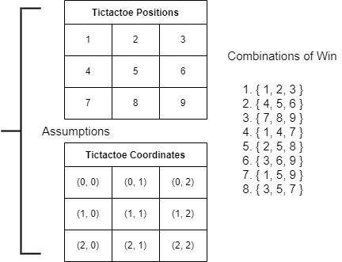

# tictactoe

## Hours spend
- 4 hours working on the code base including the time to fix wrong behavior
- 2 hours building unit test to validate the core logic of the game

## Diagram of data structure built for tictactoe

